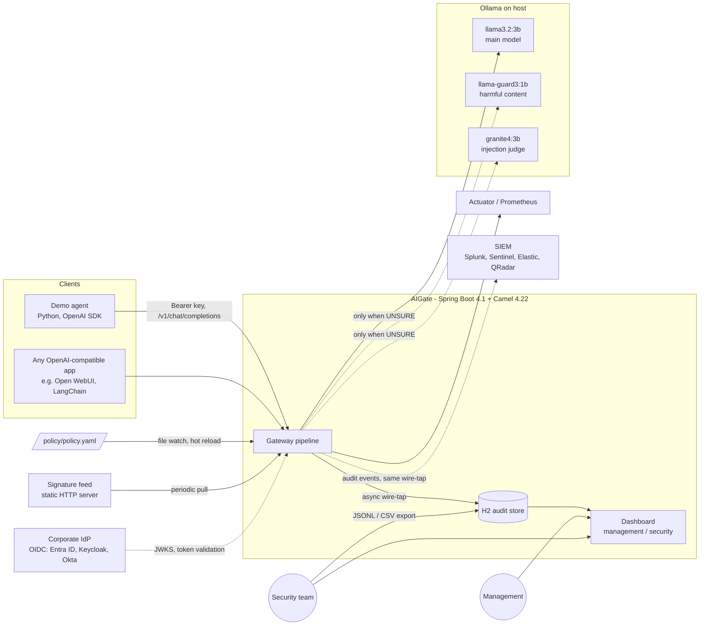
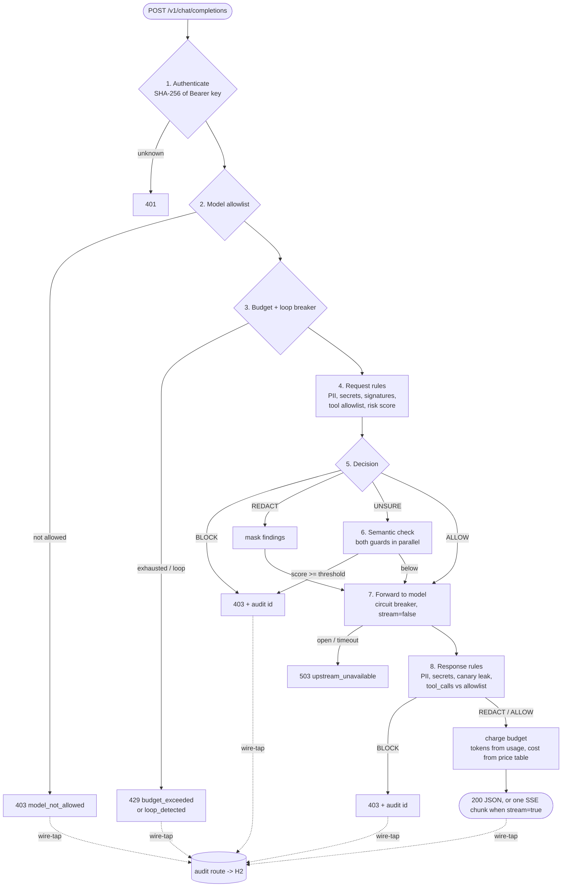
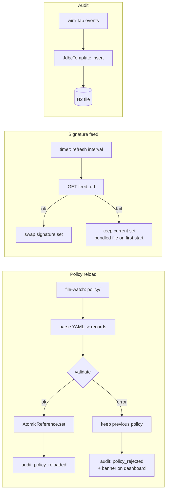
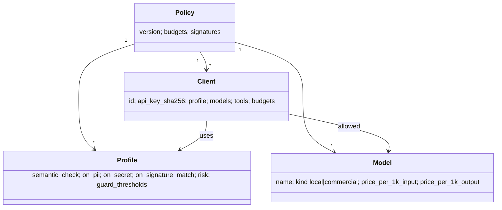

# AIGate architecture

AIGate is an OpenAI-compatible gateway. A client changes one setting, its base URL, and from then on every chat completion, tool definition and tool call goes through the gateway. The gateway checks it against a central policy, charges it to a budget and writes an audit event. There is no SDK to install and no change to client code.

Status: implemented. Measured numbers are in the README; extension points in section 8 are interfaces with documented configuration.

## 1. Context



Docker Compose runs two containers: `aigate` and `signature-feed`. Ollama stays on the host, because on macOS the models only use the GPU (Metal) outside Docker.

Dashed lines to the IdP and the SIEM are extension points, see section 8. The hackathon build ships API keys and the H2 store; both are behind interfaces so a corporate IdP and a SIEM plug in without touching the pipeline.

## 2. Request pipeline

Each step is a Camel processor in one route. Every step adds its own latency to the exchange, and the audit event carries the whole list.



Why this order:

- Cheapest checks first. Auth, allowlist and budget are map lookups. A request without a valid key never reaches the regex engine.
- Budget is checked before the model call, using an estimate (prompt length / 4 + `max_tokens`). It is charged afterwards from the `usage` field the model returns.
- The semantic layer is the expensive part (a local model call, roughly 100-500 ms, to be measured). It only runs on the grey zone. Clear cases are decided by rules alone.
- Audit is a wire-tap to a separate route. A slow or failing database write never delays or fails the client response.

## 3. Decision model

Rules produce two things: hard findings and a risk score.

| Rule output | Example | Effect |
|---|---|---|
| Hard finding | valid PESEL, AWS key, pickle opcode signature, disallowed tool | profile action: `allow` / `redact` / `block` |
| Soft signal | "ignore previous instructions", role-play framing, base64 blob, 20k-char input | adds to risk score 0..1 |

The profile turns that into a decision:

```
hard finding with action block      -> BLOCK
risk >= block_above                 -> BLOCK
risk >= unsure_above                -> UNSURE -> semantic check
hard finding with action redact     -> REDACT
otherwise                           -> ALLOW
semantic_check: always              -> semantic check on every request
```

The guards return `safe`/`unsafe` (Llama Guard) or `Yes`/`No` (the Granite 4 injection judge). With `logprobs` we take the probability of the first token, which gives a score to compare against `guard_thresholds`.

`on_guard_error: block | allow` per profile: strict and balanced fail closed, permissive fails open.

## 4. Supporting routes



Every in-flight request reads the policy once at the start and keeps that snapshot. A reload never changes the rules in the middle of a request.

## 5. Control catalogue and OWASP mapping

OWASP Top 10 for LLM Applications, 2025 edition.

| OWASP | Control in AIGate | Layer |
|---|---|---|
| LLM01 Prompt Injection | injection phrases from feed, risk score, Granite 4 injection judge | rules + semantic |
| LLM02 Sensitive Information Disclosure | PII with checksums (PESEL, IBAN, card, SSN), secrets, both directions | rules |
| LLM03 Supply Chain | feed signatures for untrusted model repos, `trust_remote_code`, pickle / `torch.load` payloads | rules |
| LLM05 Improper Output Handling | response scan, tool-call argument deny patterns (SQL, path traversal, shell) | rules |
| LLM06 Excessive Agency | per-client tool allowlist on offered tools and returned `tool_calls` | rules |
| LLM07 System Prompt Leakage | canary token in system prompt, checked in the response | rules |
| LLM10 Unbounded Consumption | token / cost / model-time budgets, loop breaker, circuit breaker | rules |
| (harmful content) | Llama Guard S1-S14 categories | semantic |
| Access control | API key -> client -> model allowlist | rules |

Not covered, on purpose: LLM04 Data and Model Poisoning, LLM08 Vector and Embedding Weaknesses (no RAG in scope), LLM09 Misinformation. The README will say so.

## 6. Policy model



Client-level budgets override the global ones. Profiles are the strictness levels the brief asks for; switching a client from `balanced` to `strict` is a one-line edit that takes effect on the next request.

## 7. Performance

- Virtual threads: each request blocks on HTTP to Ollama without holding a platform thread.
- Guards run in parallel, so the semantic cost is max(guard A, guard B), not the sum.
- Pre-compiled regex set, rebuilt only on policy or feed reload.
- Micrometer timer per pipeline step, p50 / p95 / p99 on the dashboard and on `/actuator/prometheus`.
- Telemetry answers the question "how much latency does AIGate add on top of the model?". Measured on an M2 Max: about 1 ms on the rules-only path, about 100 ms when the guards run, against 500 ms to several seconds for the model call.
- Guard models are pinged every 4 minutes so Ollama keeps them loaded; a cold load costs seconds.

## 8. Extension points: corporate IdP and SIEM

### Identity

Step 1 of the pipeline is an `IdentityResolver` interface, not hard-wired API key code. It turns the `Authorization` header into a `CallerIdentity`:

```
CallerIdentity(clientId, subject, onBehalfOf, groups, authMethod)
```

| Resolver | Token | Maps to policy client by | Status |
|---|---|---|---|
| `ApiKeyResolver` | opaque key | SHA-256 of the key | hackathon build |
| `OidcJwtResolver` | JWT from the corporate IdP | `azp` / `client_id` claim for agents, `groups` claim for profile selection | implemented, tested against a local JWKS |

The OIDC resolver validates the signature against the issuer's JWKS (Nimbus JOSE, cached, refetched on an unknown key id), plus `iss`, `aud` and `exp`, and accepts only asymmetric algorithms. A group mapped to a profile can tighten the client's profile, never loosen it. Policy section (example, commented out in the shipped policy):

```yaml
identity:
  oidc:
    - name: corporate
      issuer: https://login.microsoftonline.com/<tenant>/v2.0
      jwks_uri: https://login.microsoftonline.com/<tenant>/discovery/v2.0/keys
      audience: api://aigate
      client_claim: azp
      user_claim: preferred_username
      groups_claim: groups
      group_profiles: { ai-finance: strict, ai-devs: balanced }
```

Keycloak client-credentials tokens carry `preferred_username: service-account-<client>`; `service_account_pattern: "^service-account-"` keeps such values out of `onBehalfOf`. Entra ID app tokens have no user claim, so the setting has no default.

`onBehalfOf` matters for agents: when an agent acts for a user, the audit trail records both, the agent (`azp`) and the human (`sub`). That is the "agents impersonating other actors" risk from the brief.

### SIEM

The audit wire-tap already produces one `AuditEvent` per decision. Instead of writing straight to H2, it goes to a list of `AuditSink`s configured in the policy. H2 is the first sink because the dashboard reads from it. Others are Camel endpoints, so adding a SIEM is configuration, not code:

| Sink | Camel component | Typical SIEM |
|---|---|---|
| H2 | `jdbc` / `JdbcTemplate` | built-in dashboard |
| Syslog (RFC 5424) with CEF or JSON payload | `netty` (UDP/TCP), implemented | QRadar, ArcSight, Sentinel via AMA |
| HTTP Event Collector | `http`, implemented | Splunk |
| Kafka topic | `kafka`, implemented | Elastic, Splunk Connect for Kafka, any pipeline |
| Webhook | `http` | anything else |

```yaml
audit:
  sinks:
    - type: syslog
      name: siem-syslog
      host: siem.internal
      port: 5514
      protocol: udp        # udp | tcp
      format: cef          # cef | json
    - type: splunk_hec
      name: splunk
      enabled: false
      url: https://splunk.internal:8088/services/collector/event
      token_env: AIGATE_SPLUNK_HEC_TOKEN
```

The H2 store and the Micrometer metrics are always on; the policy lists only the external sinks.

Three payload formats, chosen per sink with `format`: `cef` (syslog default; ArcSight CEF, read by QRadar, ArcSight and Sentinel without a custom parser), `json` (flat AIGate fields: `client_id`, `decision`, `profile`, ...) and `ecs` (Elastic Common Schema: `@timestamp`, `event.action`, `event.outcome`, `event.duration`, `user.name`, `rule.name`, `rule.category`, `http.response.status_code`, `message`, with the flat fields kept under `aigate.*`). Sinks are independent: a SIEM that is down never blocks the H2 write or the client response. Failed sends are counted and shown on the dashboard.

Implemented: H2 (dashboard), Micrometer (Prometheus), and `SiemSink` with syslog CEF or JSON over UDP/TCP (Camel `netty`), Splunk HEC (Camel `http`) and Kafka (Camel `kafka`), configured under `audit.sinks` in the policy. Compose runs a receiver standing in for the SIEM.

The Kafka producer is bounded so a broker outage cannot back up the gateway: `max.block.ms` 2 s, delivery timeout 10 s, 8 MB buffer, asynchronous sends whose outcome feeds `aigate.audit.sink.sent` and `aigate.audit.sink.failures`. Records are keyed by `client_id`, so one client's events stay ordered on one partition.

## 9. Scalability (what changes beyond a hackathon)

| Today | Production path |
|---|---|
| Budget counters in memory, one instance | Redis with atomic counters, gateway becomes stateless |
| H2 file | Postgres for the dashboard; SIEM sinks as above |
| API keys in policy | Corporate IdP through `OidcJwtResolver` |
| Policy file on disk | Same file from git or a config server; the reload route does not change |
| Guards on local Ollama | Any OpenAI-compatible inference server (vLLM, TGI) behind the same URL |

Camel is the reason the right-hand column is mostly a change of endpoint URI, not a rewrite.

## 10. Decisions after review (3 Oct 2026)

1. `on_guard_error: block | allow` per profile is accepted. `strict` and `balanced` fail closed, `permissive` fails open.
2. Response redaction is silent: the client gets the masked text with no marker. The audit event records what was redacted and why.
3. Demo agent with real tools: open, see the proposal in the planning notes.
4. Estimate-then-charge budgets are accepted; one request may overshoot by at most its own size.
5. OIDC: implemented and tested against a local JWKS; no Keycloak container in the demo.
